Installation
============

1. Dionaea
---------------

1.1 Download dionea
~~~~~~~~~~~~~~~~~~~~

Hal yang pertama kali dilakukan yaitu mengunduh dionaea dengan menggunakan menggunakan git. Apabila belum memiliki git dapat terlebih dahulu melakukan instalasi git. Setelah itu dilanjutkan dengan mendownload dionaea dengan tool git. Dionaea tersebut dapat diperoleh dari “https://github.com/DinoTools/dionaea.git”. Detail command yang digunakan untuk instalasi git dan download dionaea seperti berikut. ::

	$sudo apt-get install git
	$git clone https://github.com/DinoTools/dionaea.git

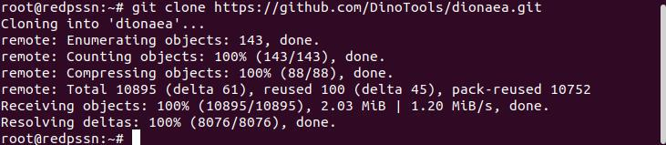

1.2 Download Library yang Diperlukan
~~~~~~~~~~~~~~~~~~~~~~~~~~~~~~~~~~~~~~~~~~~~~

Pada tahap ini akan dilakukan instalasi library yang akan dibutuhkan oleh Dionaea. Library yang dibutuhkan yaitu build-essential, check, cmake, cython3, libemu-dev, libev-devlibglib2.0-dev, libloudmouth1-dev, libnetfilter-queue-dev, libnl-3-dev, libpcap-dev, libssl-dev, dan libtool. Library libemu-dev merupakan library yang digunakan sebagai deteksi dari adanya anomali atau serangan. Library build-essential digunakan untuk proses compile bahasa sourcecode dionaea sedangkan cmake digunakan untuk instalasi pada sistem operasi. Cython3 merupakan library yang digunakan untuk menerjemahkan dari bahasa c/c++ menjadi python sehingga peformanya tetap dapat dipertahankan. Sedangkan library - library yang lain merupakan library yang mendukung fungsi - fungsi dari dionaea itu sendiri. Detail perintah yang digunakan untuk proses download library - library tersebut dapat dilihat sebagai berikut. ::

	$sudo apt install build-essential check cmake cython3 libemu-dev libev-devlibglib2.0-dev libloudmouth1-dev libnetfilter-queue-dev libnl-3-dev libpcap-dev libssl-dev libtool libudns-dev python3 python3-dev python-bson python3-yaml

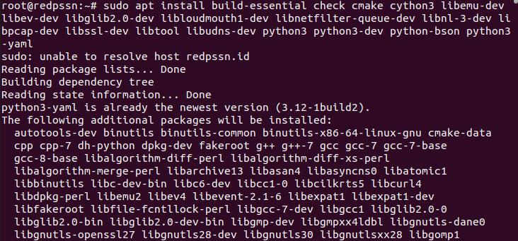

1.3 Compile Sourcecode
~~~~~~~~~~~~~~~~~~~~~~~~~~~~~

Pada tahap ini akan dimulai dengan Kemudian berpindah ke direktori /dionaea/build. Setelah itu akan menggunakan perintah “make” untuk menjalankan makefile sehingga sourcecode dionea dapat tercompile. Tahap ini digunakan untuk mempersiapkan proses instalasi. Detail perintah yang dijalankan sebagai berikut. ::

	$cd ~/dionea/build
	$make

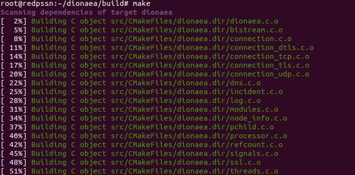

1.4 Instalasi Dionea
~~~~~~~~~~~~~~~~~~~~~

Pada tahap ini akan dilakukan pemasangan / instalasi dionaea dari file - file yang telah dicompile ke sistem operasi. Perintah yang digunakan untuk instalasi dionaea sebagai berikut. Setelah dilakukan ini maka dionaea sudah dapat digunakan. ::

	$sudo make install

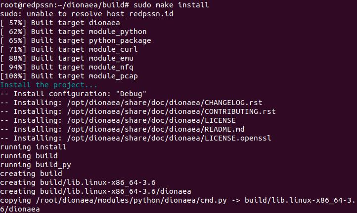

2. Cowrie
-------------

2.1 Update dan Membuat User
~~~~~~~~~~~~~~~~~~~~~~~~~~~~~~~~~~~~

Langkah pertama yaitu melakukan update terhadap sistem yang akan digunakan sebagai honeypot. Setelah itu membuat user tanpa password. Nama user yang digunakan yaitu ‘cowrie’ dan tidak terdapat password. Hal ini bertujuan untuk memberikan kerentanan terhadap akun. Detail perintah yang digunakan seperti berikut. ::

	$sudo apt-get update
	$adduser --duabled-password cowrie
	
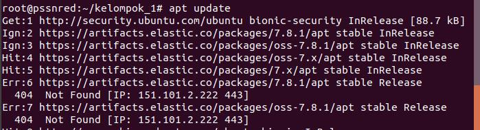

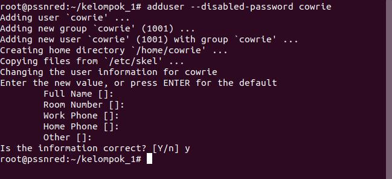

2.2 Download Library / Package yang dibutuhkan
~~~~~~~~~~~~~~~~~~~~~~~~~~~~~~~~~~~~~~~~~~~~~~~~~~~~~~~~

Pada tahap ini akan didownload dan diinstal library / pakcage yang dibutuhkan oleh Cowrie. Package dan library yang dibutuhakn yaitu iptables, iptables-persistent, linux-libc-dev, make, virtualenv, python-virtualenv, libfakeroot, libssl-dev, libffi-dev, build-essential, libpython3-dev, python3-minimal, authbind git. Iptables digunakan untuk mengatur traffic dan paket yang dapat diterima. Hal ini dikarenakan Cowrie merupakan tergolong dengan high-interaction honeypot sehingga perlu adanya batasan - batasan komunikasi kepada sistem operasi langsung. Library build-essential digunakan untuk mengcompile sourcede cowrie. Library make digunakan untuk melakukan instalasi pada sistem operasi setelah file - file cowrie sudah dicompile. Sedangkan library - library yang lain digunakan untuk memenuhi fungsi - fungsi dari cowrie. Detail perintah yang digunakan sebagai berikut. ::

	$sudo apt install -y iptables iptables-persistent linux-libc-dev make virtualenv python-virtualenv libfakeroot libssl-dev libffi-dev build-essential libpython3-dev python3-minimal authbind git

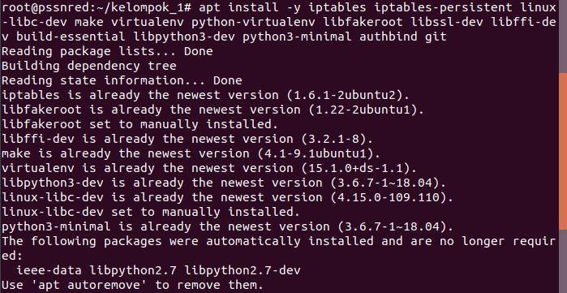

2.3 Download Cowrie

Setelah berhasil melakukan instalasi dilanjutkan dengan masuk sebagai user cowrie. Dengan menggunakan user cowrie dilanjutkan dengan download repository Cowrie yang ada di GitHub. Link tersebut yaitu “http://github.com/cowrie/cowrie”. Untuk mendowload repository tersebut dilakukan dengan menggunakan git. Detail perintah yang digunakan sebagai berikut. ::

	$su - cowrie
	$cd /home/cowrie
	$git clone http://github.com/cowrie/cowrie

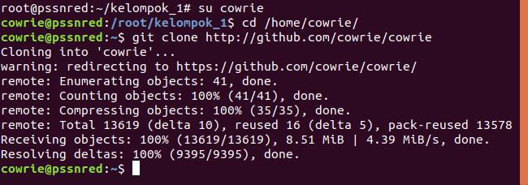

2.4 Membuat Python Virtual Environtment Cowrie
~~~~~~~~~~~~~~~~~~~~~~~~~~~~~~~~~~~~~~~~~~~~~~~~~~~

Setelah berhasil mendownload Cowrie, dilanjutkan dengan membuat Python virtual environment. Langkah awal dimulai dengan berpindah pada direktori cobwrie. Python virtual environment menyediakan lingkungan yang stabil dan terisolasi untuk python dependecies milik Cowrie. Setelah virtual environtment tersebut sudah dibuat dapat dilanjutkan dengan mengaktifkannya virtual envifontment tersebut. Selanjutnya, menjalankannya dan menginstal persyaratan tambahan menggunakan pip. Detail perintah yang digunakan sebagai berikut. ::

	$cd cowrie/
	$virtualenv --python=/usr/bin/python3 cowrie-env
	$. cowrie-env/bin/activate
	$pip install --upgrade -r requirements.txt

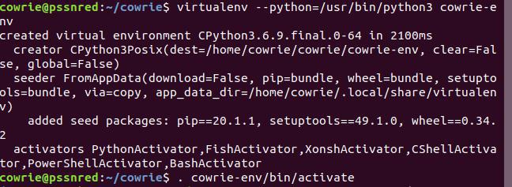

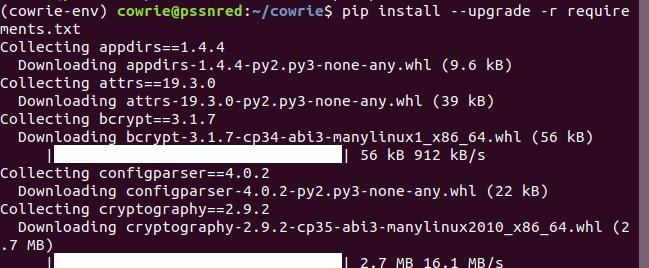

2.5 Systemd Service
~~~~~~~~~~~~~~~~~~~~~~~~~~

Pada tahap ini akan dilakukan konfigurasi pada file /bin/cowrie dengan mengganti pada bagian DAEMONIZE=” “. Hal ini untuk menonaktifkan daemonisasi saat menggunakan supervisor. Hal ini penting ketika menjalankan layanan dari cowrie. Pertama terlebih dahulu mencari file bin/cowrieletak dari file. Setelah itu dilanjutkan dengan membuka file tersebut dengan teks editor. Detail bagian yang perlu dikonfigurasi dapat dilihat sebagai berikut. ::

	$cd /home/cowrie/cowrie/
	$nano bin/cowrie

Bagian yang perlu dirubah pada file bin/cowrie sebagai berikut. ::

	DAEMONIZE="-n"

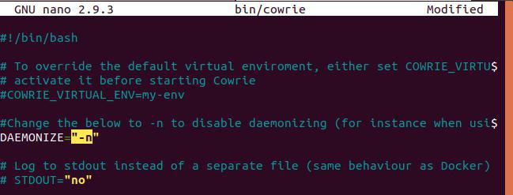

2.6 Konfigurasi Hostname dari Fake Root
~~~~~~~~~~~~~~~~~~~~~~~~~~~~~~~~~~~~~~~~~~~~~~~

Pada tahap ini akan dilakukan konfigurasi untuk mengubah hostname dari fake root yang dibuat oleh Cowrie pada file “/etc/cowrie.cfg.dist”. Untuk pertama kali perlu berpindah pada lokasi file cowrie.cfg.dst yang terletak pada direktori etc. Setelah itu dilanjutkan dengan membuka file tersebut dengan menggunakan teks editor. Setelah itu mengubah pada bagian hostname. Detail proses tersebut sebagai berikut. ::

	$cd /home/cowrie/etc/
	$nano cowrie.cfg.dist

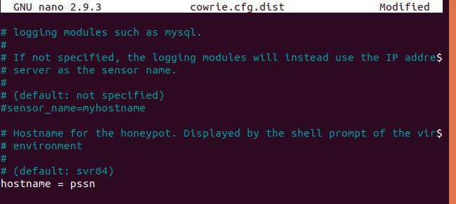

