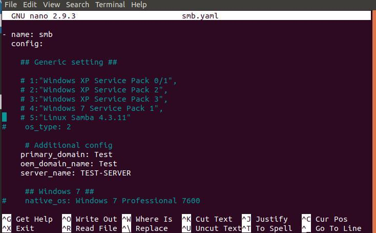
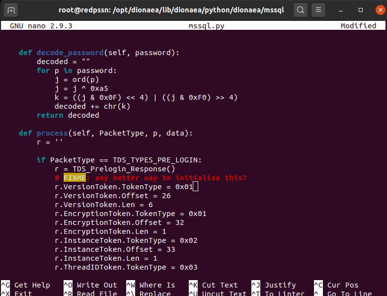
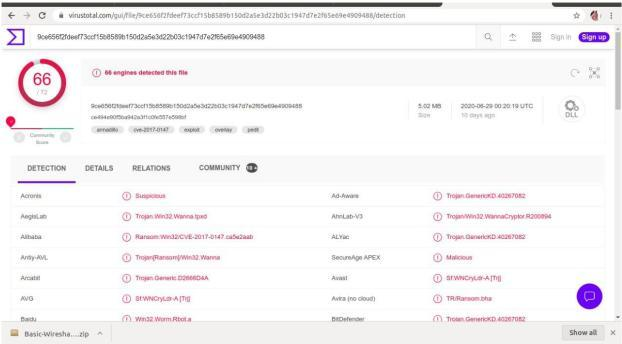

Development
===============

1. Hardening SMB
------------------------

Hardening SMB bertujuan untuk melakukan pengamanan layanan SMB karena port-nya akan dibuka secara publik. Dengan proses hardening ini bertujuan agar dapat membatasi serangan dari attacker sehingga layanan SMB yang nantinya dapat tercontrol. Proses hardening dilakukan dengan memberikan menambah konfigurasi berupa prmary domain, oem domain, dan domain name server SMB. Ketika komponen tersebut akan disetting pada server SMB. OEM domain digunakan supaya layanan file - file yang tersimpan pada server dapat terotentikasi. Primary Domain Controller digunakan untuk mengatur dan mengelola database klien. Sedangkan yang terakhir yaitu domain name server, digunakan untuk menjadi identitas dari server smb tersebut. Selain itu, hardening SMB pada dionea juga bertujuan supaya nama domain dari servernya tidak terlihat sebagai sebuah jebakan. Bagian yang perlu dirubah ditunjukan seperti berikut. Untuk mensetting agar layanan smb menjadi lebih kuat dapat menguncomment seperti berikut. ::

	primary_domain: Development
	oem_domain_name: Development
	Server_name: Development-Server

2. Hardening MS-SQL Server
----------------------------------

Selain SMB Server, bagian MS-SQL Server juga perlu dihardening yaitu MS-SQL Server. Server yang perlu diberi pengamanan seperti SMB. Sehingga mengurangi adanya serangan terhadap MS-SQL Server. Hal ini ditujukan untuk mencegah seorang attacker untuk merusak database dari dionea. Bagian yang perlu dirubah yaitu pada bagian r.VersionToken.TokenType. Perubahan dilakukan dengan mengganti nilai yang sebelumnya 0x00 menjadi 0x01. Nilai tersebut merupakan proses mengganti ke subtype token yang lebih aman dan terenkripsi. Detail proses tersebut seperti berikut. ::

	r.VersionToken.TokenType = 0x01

3. Identifikasi Menggunakan Virus Total
---------------------------------------------------

Untuk mengidentifikasi signature dari malware yang ditangkap dapat menggunakan virus total. Dari virus total, akan dimasukan salah satu signature malware yang kemudian diidentifikasi sebagai malware. Hal tersebut ditunjukan sebagai berikut. Pada gambar tersebut signature tersebut teridentifikasi malware berjenis trojan.

