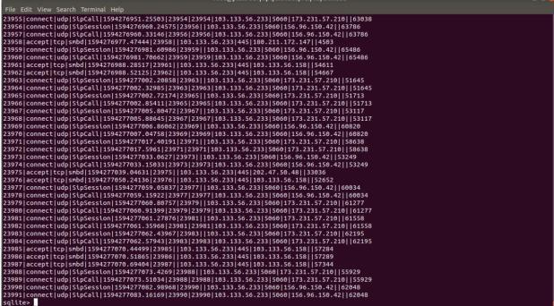

Usage
=====

1. Dionaea
-----------

1.1 Menjalanakan Dionaea
~~~~~~~~~~~~~~~~~~~~~~~~~~~~

Untuk menjalankan dionaea dapat dilakukan dengan terlebih dahulu berpindah pada lokasi file yang dapat menjalankan aplikasi dionaea tersebut. File tersebut bernama dioneaea dimana file tersebut terletak pada direktori /opt/dionaea/bin. Untuk menjalankan dionaea terlebih dahulu menggunakan super user previledge (sudo). Ketika dijalankan dionaea tersebut maka dionaea akan menyediakan layanan yang dibutuhkan oleh setiap malware. Setelah itu akan terdapat banyak malware yang akan menyerang layanan dari dionaea tersebut. Malware tersebut akan terdeteksi dan akan langsung disimpan pada database dionaea. Berikut merupakan detail dari perintah yang digunakan untuk menjalankan dionaea. ::

	$cd /opt/dionaea/bin
	$sudo ./dionaea -D

.. image :: 35.jpg

1.2 Memantau Status Koneksi
~~~~~~~~~~~~~~~~~~~~~~~~~~~~~~~

Dionaea memberikan fitur yang dapat digunakan untuk memantau koneksi. Dengan fitur tersebut maka dapat dilihat siapa saja yang mencoba berkomunikasi dengan dionaea saat waktu tersebut. Apabila terdapat seseorang yang membuat koneksi pada dionaea maka akan muncul pada status yaitu “established” yang menandakan bahwa koneksi sudah terbentuk. Jika tidak terdapat yang berkoneksi dengan dionaea maka statusnya yaitu “listen” yang menandakan bahwa dionaea sedang mendengarkan pada port tersebut. Perintah yang digunakan untuk memantau status koneksi sebahai berikut. ::

	$netstat -atn

.. image :: 33.jpg

1.3 Menghentikan Dionaea
~~~~~~~~~~~~~~~~~~~~~~~~~~~

Apabila data - data malware yang dibutuhkan oleh pengguna sudah cukup maka dapat dilanjutkan dengan tahap menghentikan proses dionea. Ketika proses dihentikan maka layanan yang diberikan oleh dionaea akan berhenti juga dan serangan malware tidak akan terdeteksi. Untuk menghentikan aplikasi dionaea dapat memanfaatkan perintah “pkill”. Sedangkan untuk memastikan apabila dionea sudah tidak berjalan dapat menggunakan command ps aux. Berikut merupakan perintah yang dapat digunakan. ::

	$sudo pkill dionaea
	$ps aux | grep dionaea

1.4 Melihat Komunikasi Penyerang
~~~~~~~~~~~~~~~~~~~~~~~~~~~~~~~~~~~~~~

Untuk melihat hasil dari serangan yang didapatkan dapat dilihat pada database dari dionea. Database tersebut berisi seluruh data - data serangan dari malware. Database serangan tersebut terletak pada direktori /opt/Dionaea/var/lib/dionaea. Database tersebut terdiri dari beberapa tables. Salah satunya yaitu table koneksi yang memperlihatkan riwayat / catatan serangan yang dilakukan ke malware. Untuk melihat table serangan tersebut dapat digunakan perintah berikut. :: 

	$cd /opt/Dionaea/var/lib/dionaea
	$sudo sqlite3 dionaea.sqlite
	> sqlite> .databases
	> sqlite> .tables
	> sqlite> SELECT* FROM connections;

1.5 Melihat Log Signature Malware
~~~~~~~~~~~~~~~~~~~~~~~~~~~~~~~~~~~~~~~~~~~~

Selain melihat komunikasi juga dapat melihat log signature malware yang berhasil tertangkap dionaea. Untuk melihat tabel log signature malware yang tertangkap oleh dionaea dapat melihat pada table log signature. Berikut merupakan perintah yang digunakan untuk menampilkan tabel log signature. ::

	> sqlite> .tables
	> sqlite> SELECT* FROM downloads;

2. Cowrie
-----------

2.1 Menjalankan Cowrie
~~~~~~~~~~~~~~~~~~~~~~~~~~~

Untuk menjalankan cowrie terlebih dahulu berpindah ke lokasi dimana file bin.cwrie berada. Dalam hal ini, proses menjalankan harus menggunakan user yang telah dibuat yaitu “cowrie”. Apabila sudah berpindah pada lokasi direktori tersebut dapat dilanjutkan dengan menggunakan perintah start sehingga aplikasi cowrie dapat dijalankan. Setelah cowrie dijalankan maka seluruh layanan cowrie akan tersedia bagi para attacker. Attacker akan berusaha memanfaatkan layanan tersebut, sehingga ketika terdapat attacker yang mencoba mengakses cowrie akan tercatat. Detail perintah yang digunakan sebagai berikut. ::

	$cd /home/cowrie/cowrie/
	$bin/cowrie start

2.2 Menghentikan Cowrie
~~~~~~~~~~~~~~~~~~~~~~~~~~~

Jika pengguna sudah cukup memperoleh data - data serangan yang diperlukan maka layanan cowrie bisa dihentikan. Perintah yang digunakan ketika menghentikan juga hampir sama dengan ketika menjalankan cowrie. Hal yang pertama dilakukan yaitu memastikan bahwa lokasi berada pada direktori terdapat file bin/cowrie. Setelah itu menggunakan perintah "stop" untuk menghentikan layanan tersebut. Ketika perintah tersebut dijalankan maka cowrie tidak akan mendeteksi serangan yang terjadi. Berikut merupakan perintah yang digunakan. ::

	$cd /home/cowrie/cowrie/
	$bin/cowrie stop

2.3 Menjalankan Cowrie dengan Root
~~~~~~~~~~~~~~~~~~~~~~~~~~~~~~~~~~~~

Cowrie juga dapat dijalankan menggunakan root. Hal yang pertama dilakukan yaitu kembali pada shell root. Setelah itu berpindah pada lokasi /etc/systemd/system/ untuk membuat file bernama cowrie-honeypot.se. Apabila sudah didapatkan maka dapat membuat file tersebut dengan teks editor dalam hal ini menggunkan nano. Setelah itu dapat memasukan baris perintah untuk menjalankan layanan cowrie. Berikut merupakan perintah untuk membuat file  ::

	$exit
	#nano /etc/systemd/system/cowrie-honeypot.service
	
Berikut perintah yang harus dimasukan pada file cowrie-honeypot.service. ::

	[Unit]
	Description=Interactive SSH Honeypot
	Wants=network.target
	[Service]
	Type=simple
	User=cowrie
	Group=cowrie
	ExecStart=/home/cowrie/cowrie/bin/cowrie start
	Restart=on-failure
	RestartSec=5	
	[Install]
	WantedBy=multi-user.target

Untuk menjalankan layanan dari cowrie dapat digunakan perintah sebagai berikut. ::

	#systemctl deaemon-reload
	#systemctl start cowrie-honeyot.service
	#status cowrie-honeypot.service

2.4 Menjalankan Iptables
~~~~~~~~~~~~~~~~~~~~~~~~~~~

Iptables pada tahap ini digunakan untuk ketika ada pengguna yang mengakses ssh dari port yang secara default yaitu 22 akan diteruskan secara otomatis ke fake root yang menggunakan port yang telah disetting yaitu port 2222. Hal ini dilakukan supaya mencegah penyerang mendapatkan root sebenarnya dari sistem operasi. Untuk membuat aturan iptables tersebut dapat dilakukan dengan menggunakan command sebagai berikut. ::

	#iptables -A PREROUTING -t nat -p tcp --dport 22 -j REDIRECT --to-port 2222
	#iptables-save > /etc/iptables/rules.v4

Untuk mengaktifkan IP forwarding dapat dilakukan dengan mengonfigurasi file “/etc/sysctl.conf”. Pastikan untuk menghilangkan tanda (#) pada baris #net.ipv4.ip_forward=1 Atau juga dapat menambahkan baris berikut pada paling bawah baris perintah. ::

	net.ipv4.ip_forward=1

Setelah itu, siapa pun yang mengakses server SSH sebagai root dan menggunakan port 22, secara otomatis akan diteruskan ke port 2222, fake root yang dibuat oleh Cowrie.

2.5 Melihat Data yang Tertangkap
~~~~~~~~~~~~~~~~~~~~~~~~~~~~~~~~~

Untuk melihat hasil serangan yang dilakukan terhadap cowrie dapat dilihat dengan melihat log pada cowrie. Log tersebut terletak pada /home/cowrie/cowrie/var/log/cowrie. Log tersebut bernama cowrie.log. Untuk melihat log tersebut dapat digunakan dengan teks editor cowrie. Berikut perintah yang digunakan. ::

	$cd /home/cowrie/cowrie/var/log/cowrie
	$cat cowrie.log

Untuk memudahkan pengembang yang ingin memanfaatkan dari log ini untuk dianalisis lebih lanjut serangan tersebut atau ingin membuat peta serangan tersebut maka tersedia log dengan format json. Berikut merupakan perintah yang digunakan untuk menampilkan format json. ::

	$cd /home/cowrie/cowrie/var/log/cowrie
	$cat cowrie.json

